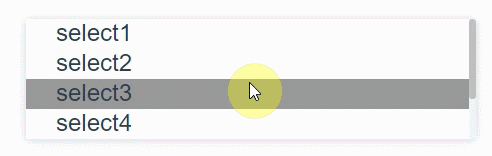
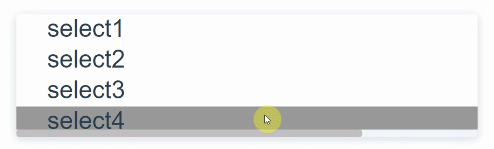

# vue-scroll-bar
[]()
[](https://travis-ci.org/YuChenLi923/vue-scroll-bar)


> a simple custom scrollbar vue component, it can support pc and mobile.





[DEMO](https://yuchenli923.github.io/vue-scroll-bar/example/demo.html)
## Install

```
npm i vue-scroll-bar --save
```

## Usage

```

<template>
   <scroll-bar class="warp" :scrollTrackStyle="scrollTrackStyle" :scrollBarStyle="scrollBarStyle">
      <div class="test">
         <p>select1</p>
         <p>select2</p>
         <p>select3</p>
         <p>select4</p>
         <p>select5</p>
         <p>select6</p>
      </div>
   </scroll-bar>
</template>

import scrollBar from 'vue-date-picker';
export default {
    components: { scrollBar },
    data() {
      return {
        scrollTrackStyle: {
          backgroundColor: 'red'
        },
        scrollBarStyle: {
         ...
        }
      };
    }
};
<style>
.warp{
  height: 80px;
  overflow: hidden;
}
</style>
```

## Props

| Props               | Type      | Default                                         | Description  |
| --------------------|:----------| ------------------------------------------------|--------------|
| scrollTrackStyle    |  Object     | {} | the style of scroll track
| scrollTrackYStyle    |  Object     | scrollTrackStyle | the style of scroll track  in the direction of Y axis
| scrollTrackXStyle    |  Object     | scrollTrackStyle | the style of scroll track  in the direction of X axis
| scrollBarStyle    |  Object     | {} | the style of scroll bar
| scrollBarYStyle    |  Object     | scrollBarStyle | the style of scroll bar in the direction of Y axis
| scrollBarXStyle    |  Object     | scrollBarStyle | the style of scroll bar in the direction of X axis
| barYMinHeight | Number | 20 |  the min height of scroll bar in the direction of Y axis
| barXMinWidth | Number | 20 |  the min width of scroll bar in the direction of X axis
| scrollDis | Number | 130|  The distance of scrollbar moving when you click the track
| scrollYDis | Number | scrollDis| The distance of scrollbar moving  in the direction of X axis when you click the scroll track
| scrollXDis | Number | scrollDis| The distance of scrollbar moving  in the direction of Y axis when you click the scroll track
| overflow | String | 'auto'| 'auto', 'hidden', 'hidden-x', 'hidden-y'
| watchValue | Any | `null` |  when content expands, bar would be refreshed
