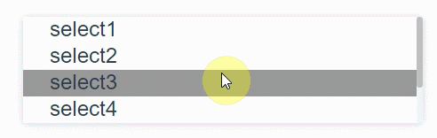

# vue-scroll-bar

> a simple custom scrollbar vue component



## Install

```

npm i vue-scroll-bar --save

```

## Usage

```

<template>
   <scroll-bar class="warp" :scrollTrackStyle="scrollTrackStyle" :scrollBarStyle="scrollBarStyle">
      <div class="test">
        <p>xxxxxxxxxx</p>
        <p>xxxxxxxxxx</p>
        <p>xxxxxxxxxx</p>
        <p>xxxxxxxxxx</p>
        <p>xxxxxxxxxx</p>
        <p>xxxxxxxxxx</p>
      </div>
   </scroll-bar>
</template>

import scrollBar from 'vue-date-picker';
export default {
    components: { scrollBar },
    data() {
      return {
        scrollTrackStyle: {
          backgroundColor: 'red'
        },
        scrollBarStyle: {
         ...
        }
      };
    }
};
```

## Props

| Props               | Type      | Default                                         | Description  |
| --------------------|:----------| ------------------------------------------------|--------------|
| scrollTrackStyle    |  Object     | {} | the style of scroll track
| scrollBarStyle    |  Object     | {} | the style of scroll bar
| barMinHeight | Number | 20 |  the min height of scroll bar
| scrollDis | Number | 130| The distance of each scroll
